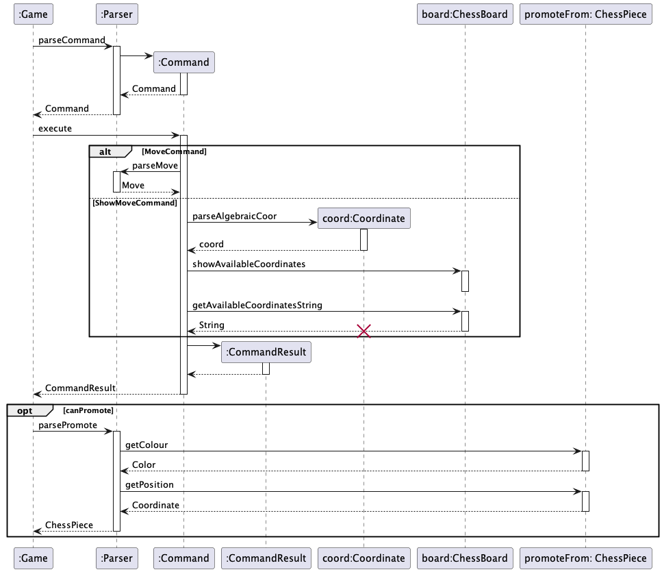

# Developer Guide

## Acknowledgements

{list here sources of all reused/adapted ideas, code, documentation, and third-party libraries -- include links to the original source as well}

## Design & implementation

{Describe the design and implementation of the product. Use UML diagrams and short code snippets where applicable.}

### User Input - `Parser` and `Command`
In order to handle user input into the program during the game, the `Parser` class was implemented.
Below is a sequence diagram describing the process of handling user input passed from `Game`:

As can be seen above, `Parser` works to resolve a player's input in the following manner:

1. When `Parser` is called to parse a command, it returns the relevant `Command` object (More precisely,
one of its subclasses), which is then executed by `Game`.
2. Depending on the type of `Command` returned, the following may occur: 
   1.  If it is a `MoveCommand`, the Command calls `parseMove` to instantiate the `Move`,
   which is passed back to `Game` to be executed in the main logic.
   2. If it is a `ShowMovesCommand`, `parseAlgebraicCoor` is called to obtain the position of the piece as a 
   `Coordinate` object. The available coordinates are printed using `showAvailableCoordinates`, then stored as a String
   by `getAvailableCoordinatesString()`.
3. The result is then encapsulated in a `CommandResult` and returned to `Game` to be handled.
4. If the player made a move resulting in a promotion, `parsePromote` is called.
5. `Parser` calls `getColor` and `getPosition` to retrieve relevant data from the `ChessPiece` 
the player wants to promote.
6. The user's input is parsed and a new, promoted `ChessPiece` is returned.

`Parser` also contains methods to fulfil parsing needs in other parts of the program, for instance `parseChessPiece`, 
which is called while loading the .txt file containing save data, called for each character representing a 
singular chess piece. Using a Case statement, it returns the relevant `ChessPiece` object depending on the character
(representing the type of piece), and whether it is capitalised (representing colour).

## Product scope
### Target user profile

{Describe the target user profile}

### Value proposition

{Describe the value proposition: what problem does it solve?}

## User Stories

|Version| As a ... | I want to ... | So that I can ...|
|--------|----------|---------------|------------------|
|v1.0|new user|see usage instructions|refer to them when I forget how to use the application|
|v2.0|user|find a to-do item by name|locate a to-do without having to go through the entire list|

## Non-Functional Requirements

{Give non-functional requirements}

## Glossary

* *glossary item* - Definition

## Instructions for manual testing

{Give instructions on how to do a manual product testing e.g., how to load sample data to be used for testing}
